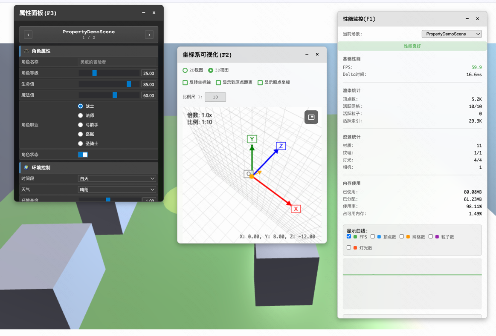

# Babylon Forge

一个基于 Babylon.js 和 WebGPU 的 3D 游戏引擎框架，提供完整的开发工具链和调试系统。

## 🚀 特性

- **WebGPU 渲染引擎**: 使用最新的 WebGPU 技术，提供高性能的 3D 渲染
- **场景管理系统**: 灵活的场景切换和管理机制
- **调试面板系统**: 内置多种调试面板，包括性能监控、属性面板、坐标系可视化
- **依赖注入容器**: 基于装饰器的依赖注入系统
- **单例模式管理**: 统一的单例模式管理
- **组件系统**: 基于装饰器的组件系统，支持生命周期管理
- **相机系统**: 支持生存模式和创造模式相机

## 📦 技术栈

- **核心框架**: Babylon.js 8.36+
- **渲染引擎**: WebGPU
- **物理引擎**: Havok Physics
- **开发语言**: TypeScript
- **构建工具**: Vite

## 🛠️ 安装

```bash
# 克隆项目
git clone https://github.com/Error-Zhang/babylon-forge.git
cd babylon-forge

# 安装依赖
npm install

# 启动开发服务器
npm run dev

# 构建生产版本
npm run build

# 预览构建结果
npm run preview
```

## 🎮 快速开始

### 基础使用

```typescript
import GameApp from './entry/GameApp.ts';

// 创建游戏应用实例
const app = new GameApp('game-canvas', 'high');

// 初始化场景
await app.initialize('ComponentDemoScene', { enablePhysics: true });
```

### 调试模式

启用调试模式和调试面板：

```typescript
const isDebugMode = true;
const useDebugPanel = true;

const app = new GameApp('game-canvas', isDebugMode ? 'debug' : 'high');
await app.initialize('ComponentDemoScene', { enablePhysics: true });

if (isDebugMode && useDebugPanel) {
    // 性能监控面板 (F1)
    panelManager.create(PerformancePanel, { toggleKey: 'F1' });
    
    // Canvas坐标系可视化面板 (F2)
    panelManager.create(CanvasCoordinatePanel, { toggleKey: 'F2' });
    
    // 属性面板 (F3)
    panelManager.create(PropertyPanel, { toggleKey: 'F3' });
}
```

## 📁 项目结构

```
src/
├── components/           # 场景组件
│   └── SceneComponent.ts
├── configs/              # 配置文件
│   ├── env.config.ts     # 环境配置
│   └── index.ts
├── core/                 # 核心模块
│   ├── WebGpuStarter.ts  # WebGPU引擎启动器
│   ├── extends/          # 扩展功能
│   └── reactivity/       # 响应式系统
├── debug/                # 调试工具
│   ├── PerformancePanel.ts      # 性能监控面板
│   ├── PropertyPanel.ts         # 属性面板
│   ├── CanvasCoordinatePanel/   # 坐标系可视化面板
│   └── components/              # 调试组件
├── demos/                # 演示场景
│   ├── ComponentDemoScene.ts    # 组件演示场景
│   ├── LightDemoScene.ts        # 光照演示场景
│   ├── PhysicsDemoScene.ts      # 物理演示场景
│   ├── PropertyDemoScene.ts     # 属性演示场景
│   └── player/                  # 玩家相关
├── entry/                # 应用入口
│   ├── GameApp.ts        # 游戏应用主类
│   └── constants.ts      # 常量定义
├── global/               # 全局工具
│   ├── Decorators.ts     # 装饰器
│   ├── Singleton.ts      # 单例模式
│   ├── DIContainer.ts    # 依赖注入容器
│   └── DemoSceneClass.ts # 演示场景基类
├── managers/             # 管理器
│   ├── SceneManager.ts   # 场景管理器
│   └── SoundManager.ts   # 音效管理器
├── misc/                 # 杂项工具
│   ├── chrome.ts         # 浏览器工具
│   ├── screen.ts         # 屏幕工具
│   └── utils.ts          # 通用工具
└── main.ts               # 应用入口文件
```

## 🎯 核心功能

### 1. 场景系统

#### 创建新场景

```typescript
import { DemoSceneClass } from '@/global/DemoSceneClass.ts';
import { Scene, MeshBuilder, Vector3 } from '@babylonjs/core';

class MyScene extends DemoSceneClass {
    async *create() {
        const scene = new Scene(this.engine);
        yield scene;
        
        // 创建相机和光源
        const camera = new FreeCamera('camera', new Vector3(0, 5, -10), scene);
        const light = new HemisphericLight('light', new Vector3(0, 1, 0), scene);
        
        // 创建几何体
        const box = MeshBuilder.CreateBox('box', { size: 1 }, scene);
    }
}
```

#### 场景注册

```typescript
// 在 src/entry/constants.ts 中注册场景
export const SCENE_MAPPINGS = {
    MyScene: () => import('@/demos/MyScene').then((m) => m.default),
    // ... 其他场景
};
```

### 2. 组件系统

#### 创建组件

```typescript
import { SceneComponent } from '@/components/SceneComponent.ts';

class MyComponent extends SceneComponent {
    onCreated() {
        console.log('组件已创建');
    }
    
    onMounted() {
        console.log('组件已挂载');
    }
    
    onBeforeUpdate(deltaTime: number) {
        // 每帧更新前调用
    }
    
    onAfterUpdate(deltaTime: number) {
        // 每帧更新后调用
    }
    
    onDisposed() {
        console.log('组件已销毁');
    }
}
```

#### 使用 FieldMonitor 装饰器

```typescript
import { FieldMonitor } from '@/global/FieldMonitorDecorator.ts';

class MyComponent extends SceneComponent {
    @FieldMonitor({
        name: '速度',
        group: '物理',
        type: 'number',
        range: { min: 0, max: 10, step: 0.1 },
        onChange: (self, newValue, oldValue) => {
            console.log(`速度从 ${oldValue} 变为 ${newValue}`);
        }
    })
    speed: number = 5;
    
    @FieldMonitor({
        name: '启用',
        group: '控制',
        type: 'boolean'
    })
    enabled: boolean = true;
}
```

### 3. 依赖注入

#### 使用 Inject 装饰器

```typescript
import { Inject } from '@/global/Decorators.ts';
import { WebGPUEngine, Scene } from '@babylonjs/core';

class MyService {
    @Inject(WebGPUEngine)
    private engine!: WebGPUEngine;
    
    @Inject(Scene)
    private scene!: Scene;
    
    doSomething() {
        // 使用注入的依赖
        this.engine.resize();
    }
}
```

#### 注册服务

```typescript
import { diContainer } from '@/global/DIContainer.ts';

// 注册服务
diContainer.register(MyService, new MyService());

// 获取服务
const service = diContainer.get(MyService);
```

### 4. 单例模式

```typescript
import { Singleton, SingleClass } from '@/global/Singleton.ts';

class MySingleton extends SingleClass {
    private data: string = 'singleton data';
    
    getData(): string {
        return this.data;
    }
    
    setData(value: string): void {
        this.data = value;
    }
    
    dispose(): void {
        // 清理资源
    }
}

// 创建单例
const instance = Singleton.create(MySingleton);

// 获取单例
const sameInstance = MySingleton.Instance;

// 或者使用泛型
const typedInstance = MySingleton.getInstance<MySingleton>();
```

### 5. 玩家相机系统

#### 生存模式相机

```typescript
import { SurvivalCamera } from '@/demos/player/PlayerCamera.ts';

const camera = new SurvivalCamera(new Vector3(0, 5, -10));
// 支持碰撞检测、跳跃、移动
```

#### 创造模式相机

```typescript
import { CreativeCamera } from '@/demos/player/PlayerCamera.ts';

const camera = new CreativeCamera(new Vector3(0, 5, -10));
// 支持自由飞行、无碰撞移动
```

### 6. 调试面板

#### 性能监控面板

```typescript
import { PerformancePanel } from '@/debug/PerformancePanel.ts';

panelManager.create(PerformancePanel, {
    toggleKey: 'F1',
    theme: 'dark',
    updateInterval: 500,
    showGraphs: true,
    showEngineInfo: true
});
```

功能特性：
- 实时 FPS 监控
- 渲染统计（顶点数、网格数、粒子数）
- 内存使用监控
- WebGPU 设备信息
- 性能曲线图
- 场景切换功能

#### 属性面板

```typescript
import { PropertyPanel } from '@/debug/PropertyPanel.ts';

panelManager.create(PropertyPanel, {
    toggleKey: 'F3',
    theme: 'dark',
    updateInterval: 500
});
```

功能特性：
- 实时属性监控和修改
- 支持多种数据类型（数字、布尔值、枚举、向量、颜色）
- 分组显示
- 属性验证
- 变化回调

#### 坐标系可视化面板

```typescript
import { CanvasCoordinatePanel } from '@/debug/CanvasCoordinatePanel/CanvasCoordinatePanel.ts';

panelManager.create(CanvasCoordinatePanel, {
    toggleKey: 'F2'
});
```

功能特性：
- 2D Canvas 坐标系可视化
- 3D 场景坐标系可视化
- 实时坐标监控
- 坐标转换工具

## 🔧 配置说明

### 环境配置

```typescript
// src/configs/env.config.ts
const development = {
    DEBUG: true,
    USE_DEBUG_PANEL: true,
};

const production = {
    DEBUG: false,
    USE_DEBUG_PANEL: false,
};
```

### WebGPU 引擎配置

```typescript
interface WebGPUEngineOptions {
    antialias?: boolean;           // 抗锯齿
    adaptToDeviceRatio?: boolean;  // 适应设备像素比
    powerPreference?: 'high-performance' | 'low-power';  // 电源偏好
    forceFallbackAdapter?: boolean;  // 强制使用回退适配器
    sampleCount?: 1 | 4;           // 多重采样数量
    enableGPUDebug?: boolean;      // 启用GPU调试
    requiredFeatures?: GPUFeatureName[];  // 需要的WebGPU特性
    requiredLimits?: Record<string, number>;  // 需要的WebGPU限制
    maxFPS?: number;               // 最大帧率限制
}
```

## 🎨 演示场景

### 项目效果展示



### 1. ComponentDemoScene
组件生命周期演示场景，展示组件的创建、挂载、更新、销毁过程。

### 2. LightDemoScene
光照演示场景，展示多种光源类型和光照效果。

### 3. PhysicsDemoScene
物理演示场景，展示 Havok 物理引擎的各种功能：
- 刚体物理
- 碰撞检测
- 关节约束
- 物理材质

### 4. PropertyDemoScene
属性面板演示场景，展示 FieldMonitor 装饰器的各种用法。

## 🚨 要求

- 现代浏览器 (Chrome 113+, Edge 113+)
- 支持 WebGPU 的浏览器
- Node.js 16+

## 🤝 贡献

1. Fork 项目
2. 创建功能分支 (`git checkout -b feature/AmazingFeature`)
3. 提交更改 (`git commit -m 'Add some AmazingFeature'`)
4. 推送到分支 (`git push origin feature/AmazingFeature`)
5. 开启 Pull Request

## 📄 许可证

本项目采用 MIT 许可证 - 查看 [LICENSE](LICENSE) 文件了解详情。

## 🙏 致谢

- [Babylon.js](https://www.babylonjs.com/) - 强大的 3D 引擎
- [WebGPU](https://webgpu.io/) - 现代图形 API
- [Havok Physics](https://www.havok.com/havok-physics/) - 物理引擎

## 📞 联系

如有问题或建议，请提交 Issue 或联系项目维护者。